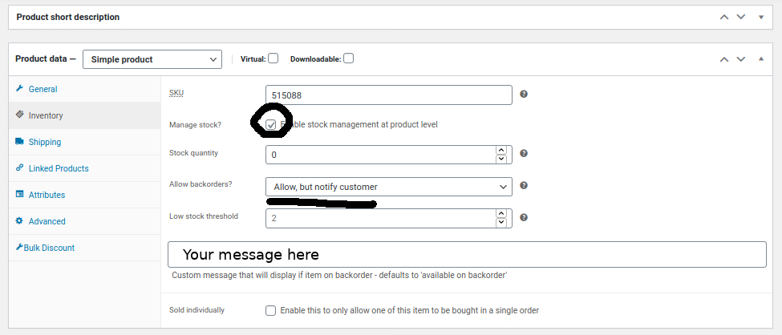

# Custom Backorder Messages For Woocommerce

Contributors: gregbast1994
Donate link: https://gregbastianelli.com
Tags: woocommerce, backorders, wc-backorder, stock-settings, manage stock, backorder messages, custom
Requires at least: 4.0
Tested up to: 5.4
Stable tag: 1
Requires PHP: 7.0
License: GPLv2 or later
License URI: https://www.gnu.org/licenses/gpl-2.0.html

## Description

Allows the author to provide a product or variation a custom backorder message.

This is useful when you've got a hot item but no stock until January 2021.

This is a simple plugin which adds a "backorder message" field to the Edit Product page.

## Usage

Usage is easy - there is no configuration just added fields to your simple and variation products.

The field is located in two spots - depending on the product type.

### SIMPLE PRODUCTS

- Field is located at Edit Product > Product Details > Inventory.
- Write your custom message
- Set allow backorders to "allow, but notify".

### VARIATION PRODUCTS

- Field is is located at Edit Product > Product Details > Variations.
- Select a varation and check "Manage Inventory".
- Write your custom message.
- Set allow backorders to "allow, but notify".
